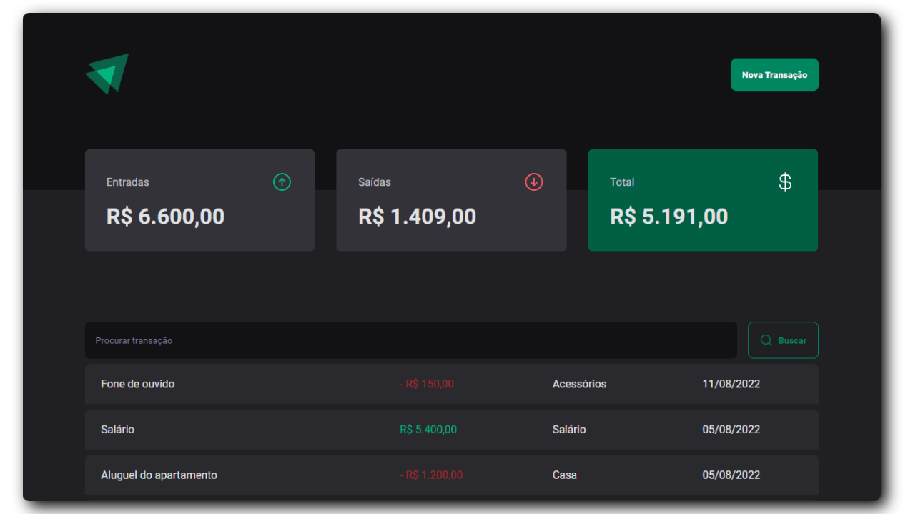

<h1 align="center">Finance App</h1>

<div align="center">
    
    
    
    
</div>

## :camera: Captura

<p align="center"></p>

## :page_with_curl: Descrição

Projeto frontend com o objetivo de controlar transações de entrada e saída

## :gear: Rodando a aplicação

### :globe_with_meridians: Web

Você pode acessar este url: https://finance-app-five-kappa.vercel.app/ se ainda estiver funcionando ¯\\_(ツ)_/¯

### :computer: Local

Faça o fork deste repositório. Fique a vontade para criar novas pullrequests

#### Instale as dependências

```
yarn install
```

#### Inicie o json-server

```
yarn dev:server
```

#### Inicie a aplicação

```
yarn dev
```

## :hammer_and_wrench: Ferramentas

<p>


</p>

## :adult: Contribuidores

<!-- ALL-CONTRIBUTORS-LIST:START - Do not remove or modify this section -->
<!-- prettier-ignore-start -->
<!-- markdownlint-disable -->
<table>
  <tbody>
    <tr>
      <td align="center" valign="top" width="14.28%"><a href="https://gustavohenrique.vercel.app/"><br /><sub><b>Gustavo Henrique</b></sub></a><br /><a href="#code-Gustavohps10" title="Code">💻</a></td>
    </tr>
  </tbody>
</table>

<!-- markdownlint-restore -->
<!-- prettier-ignore-end -->

<!-- ALL-CONTRIBUTORS-LIST:END -->
